# Contents
* [**Project Goals**](<#project-goals>)
    *  [User Goals](#user-goals)
    *  [Site Owner Goals](#site-owner-goals)
* [**User Experience UX**](<#user-experience-ux>)
    *  [User Stories](<#user-stories>)
   1. [Structure](#structure)
        1. [Website pages](#website-pages)
        2. [Code Structure](#code-structure)
        3. [Database](#database)
        4. [Physical database model](#physical-database-model)
        5. [Models](#models)
            1. [User Model](#user-model)
            2. [Profile Model](#profile-model)
            3. [Food_item Model](#food_item-model)
            4. [Review Model](#review-model)
            5. [Order Model](#order-model)
            6. [AboutMe Model](#aboutme-model)
    2. [Scope](#scope)
        1. [User Stories](#user-stories)
    3. [Skeleton](#skeleton)
        1. [Wireframes](#wireframes)
    4. [Surface](#surface)
        1. [Design Choices](#design-choices)
        2. [Colour](#colours)
        3. [Fonts](#fonts)
6. [Technologies Used](#technologies-used)
    1. [Languages](#languages)
    2. [Frameworks & Tools](#frameworks-&-tools)
7. [Features](#features)
8. [Testing](#validation)
    1. [HTML Validation](#HTML-validation)
    2. [CSS Validation](#CSS-validation)
    3. [JS Validation](#JS-validation)
    4. [Python Validation](#py-validation)
    5. [Accessibility](#accessibility)
    6. [Performance](#performance)
    7. [Device testing](#performing-tests-on-various-devices)
    8. [Browser compatibility](#browser-compatibility)
    9. [Testing user stories](#testing-user-stories)
9. [Bugs](#Bugs)
10. [Deployment](#deployment)
11. [Credits](#credits)
12. [Acknowledgements](#acknowledgements)

## Project Goals
*Placeholder

## User Experience (UX)

-   ### Target Audience
1. Users looking to retrieve order food online.

## User stories

-   ### User

1.    I want to be able to see menu and what I can order.
2.    I want to be able to navigate site easily.
3.    I want clear information on where the restaurant is located.
4.    I want to be able to order food online.
5.    I want to be able to know my order has been accepted.
6.    I want to view reviews so that I know what others thought of previous orders.
7.    I want to be able to cancel my order.
8.    I want to be able to modify my order.
9.    I want to view About me page so that I know more about the company
10.   I want to see confirmation page of my order so that I know how much it will cost and they have my correct details.

-   ### Registered User

1.    I want to be able to register my information and have it stored so I can easily order without having to fill out details.
2.    I want to be able to leave reviews.
3.    I want to delete my review.
4.    I want to modify my review.
5.    I want to see my order history.
6.    I want to modify my profile details
    
-   ### Site Owner

9.    I want to be able to manage reviews
10.   I want to be able to approve reviews
11.   I want to be to approve orders
12.   I want to be able to reject orders

## Scope

1. For first release, the scope is to provide users ability to register, login and oder food.
2. Future scope:
    1. User can cancel order
    2. User modify my order
    3. User see order history

#### Overview

Article from above is from 2021. The listed most popular takeaway by Irish people during lockdown was chippers and after chips the most ordered item was sauce. My brother is heading away soon to begin his adventure in Canada in honour of him and his help for this project it lead me to pay homage by picking the most popular dish there Poutine, which is a delicacy of chips, gravy and cheese curds. This site is target at offering user the capability of ordering poutine online from Curdine takeaway service.

## Structure
### Code Structure
The project is organised into a two applications, developed using the Django Framework.

App details as follows:
- customer - this app contains information about the user and is extended by the profile model to contain further details such as email, fullname, phone number and address details.
- takeaway - this app contains the menu structure, users can choose between the varies meals from menu.  Clicking individual items opens a sub  page where users can see detailed food information and can leave a review if they are a rigestered user.

To complement the apps there are
- project: Project level files - settings.py for project level settings and urls.py to route the website URLS
- templates: Containing the base.html, allauth(django authentication)
- templates (app level): each app has it's own templates directory for HTML to consider portability and re-use.
- urls (app level): each app has it's own url.py file to consider portability and re-use.
- static: Base css and Javascript files
- manage.py: This file is used to start the site and perform funcions during development
- README.md: Readme documentation
- Procfile: To run the application on Heroku
- Requirements.txt: Containing the project dependencies
Note: Environment variable values are not exposed in the source code, they are stored locally in env.py that is not checked in(and listed in .gitignore, and on Heroku in app settings

#### Physical database model

This model contains all fields stored in the database collections with their data type and mimics the structure of what is actually stored in the Postgres database 
 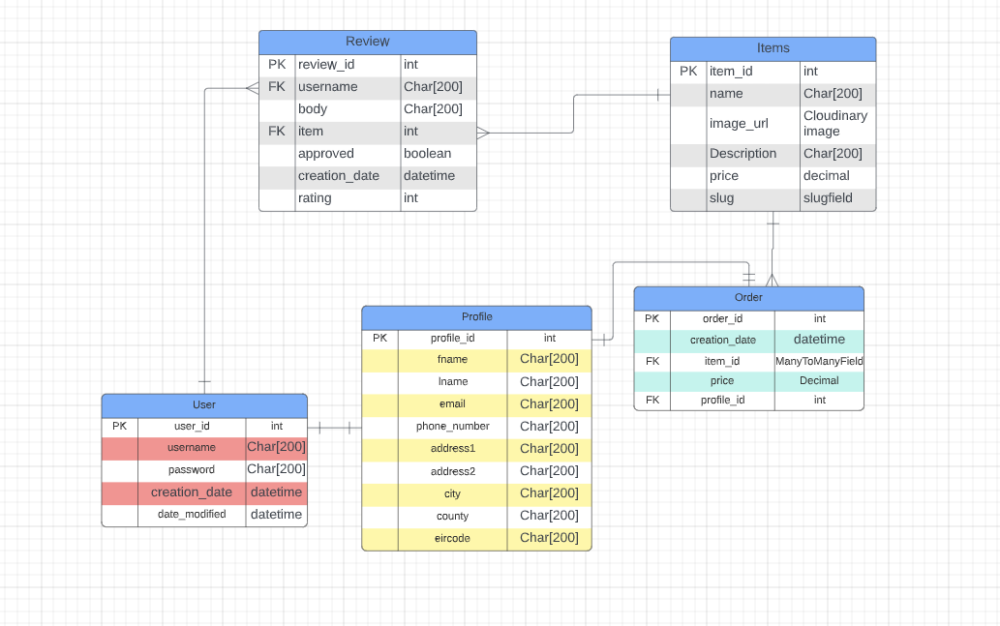

#### Models
- The following models were created to represent the database model structure for the website

##### User Model
- The User model contains information about the user. It is part of the Django allauth library
- The model contains the following fields: username, password, first_name, last_name, is_staff, is_active, is_superuser, last_login, date_joined

##### Profile Model
- The Meal model contains information about user such as contains further details such as email, fullname, phone number and address details for delivery purposes.
- It contains User as a foreign-key.
- The model contains the following fields:  email, Name, phone_number, address1, address2, city, county, eir_code

##### Food_item Model
- The category model contains the available meal items
- The model contains the following fields: food_name, food_image, description, price, slug

##### Review Model
- The Review model is the review model for food items for user to leave a review on a food item to let restraunt and others know thoughts on food item.
- It contains Food_item as a foreign-key.
- When user submits review it is sent to the back end for the admin to approve before being displayed to the site.
- The model contains the following fields: Food_item, name, email, body, creation_date, approved.

##### Order Model
- The Order model the user to be able to submit order from the website with items and address details.
- The model contains the following fields: creation_date, email, name, phone_number, address1, address2, city, county, eir_code.

##### AboutMe Model
- The About me model for the site owner to be able to update about me section of website with text on backend.
- The model contains the following fields: about_text_body, date_modified.

## Scope
### User stories:

#### First time user
1.	As a first time user, I want to be able to see menu and what I can order.
2.	As a first time user, I want to be able to navigate site easily
3.	As a first time user, I want clear information on where the restaurant is located
4.	As a first time user, I want to be able to order food online
5.	As a first time user, I want to view reviews so that I know what others thought of previous orders
6.	As a first time user, I want to view About me page so that I know more about the company and it’s ethos
7.	As a logged in user, I want to be able to see other user’s comments and reviews
8.	As a logged in user, I want to be able to be able to leave reviews
9.	As a first time user, I want to be able to delete my review
10.	As a first time user, I want to see confirmation page of my order so that I know how much it will cost and they have my correct details
11.	As a first time user, I want to be able to know my order has been accepted
12.	As a first time user, I want to know about the business and it’s ethos
13.	As a first time user, I want to be able to cancel my order
14. As a logged in user, I want to be able to to sign in to, or create an account
15. As a logged in user, I want to be able to log out of an account
16. As a first time user, I want to see confirmation page of my order so that I know how much it will cost and they have my correct details
17. As a first time user, I want to be able to view the business’ social media
18. As a logged in user, I want to be able to cancel my order
19. As a logged in user, I want to be able to modify my order

#### Site Owner
20.	As a site owner, I want to be able to Approve reviews
21.	As a site owner, I want users to be to view our full menu
22.	As a site owner, I want users to be able to view the food descriptions and prices
23.	As a site owner, I want to Manage reviews
24.	As a site owner, I want users to be able to see location of business
25.	As a site owner, I want users to be able to leave a comment or review
26.	As a site owner, I want users to be able to view other comments and reviews
27.	As a site owner, I want users to be able to edit and delete comments or reviews
28.	As a site owner, I want users to be able to find out about our business ethos
29.	As a site owner, I want users to be able to navigate the site easily and quickly
30. As a site owner, I want users to be able to sign in to, or create an account
31. As a site owner, I want users to be able to log out of their account
32. As a site owner, I want users to be able to see the menu
33. As a logged in administrator, I want to be able to review and approve or delete user comments.
34. As a site owner, I want users to be able to view the business’ social media
35. As a logged in administrator, I want to be able to create, edit or remove content on the website.

#### Error Flow
36. As first time, I user should be able to navigate back through the site structure in case of page not found without using the browser back button.
37. As a site owner, I want a 400 page that enables users to be able to return to valid areas of the site without using browser controls.
38. As a site owner, I want a 403 page that enables users to be able to return to valid areas of the site without using browser controls.
39. As a site owner, I want a 404 page that enables users to be able to return to valid areas of the site without using browser controls.
40. As a site owner, I want a 500 page that enables users to be able to return to valid areas of the site without using browser controls.

## Skeleton

### Wireframes

Home

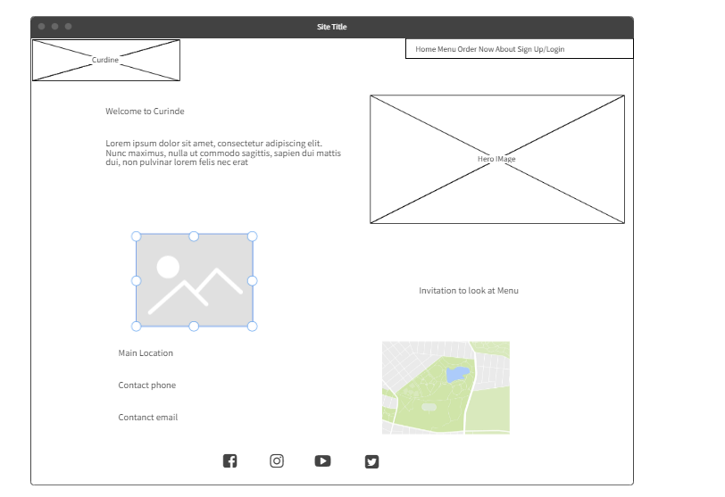
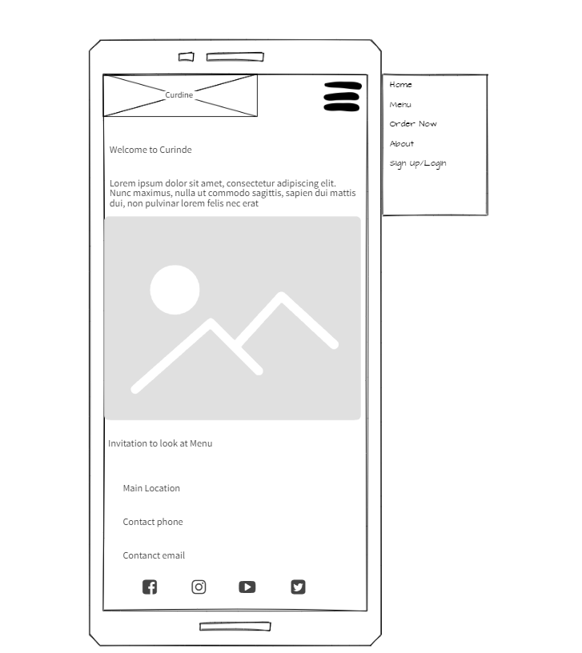

About

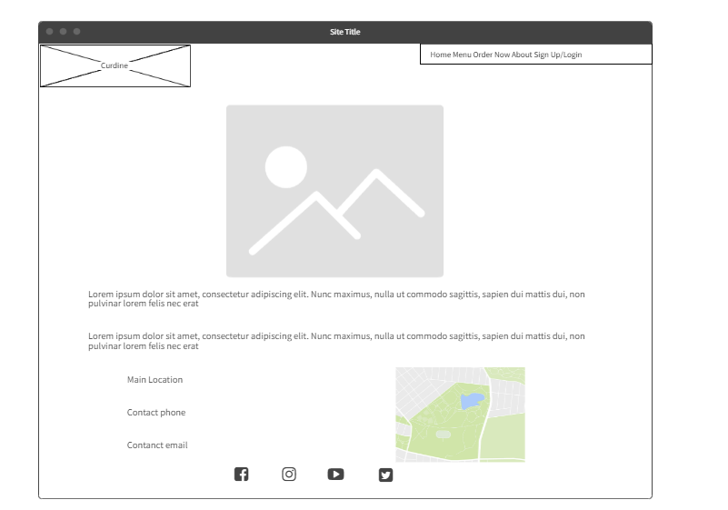
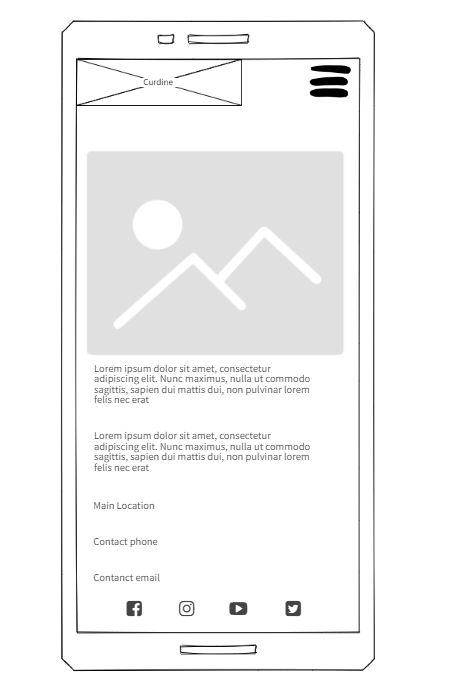

Menus

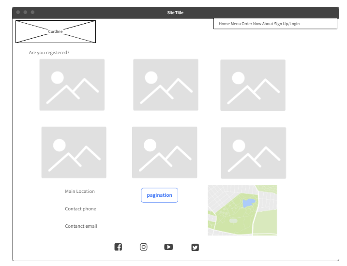
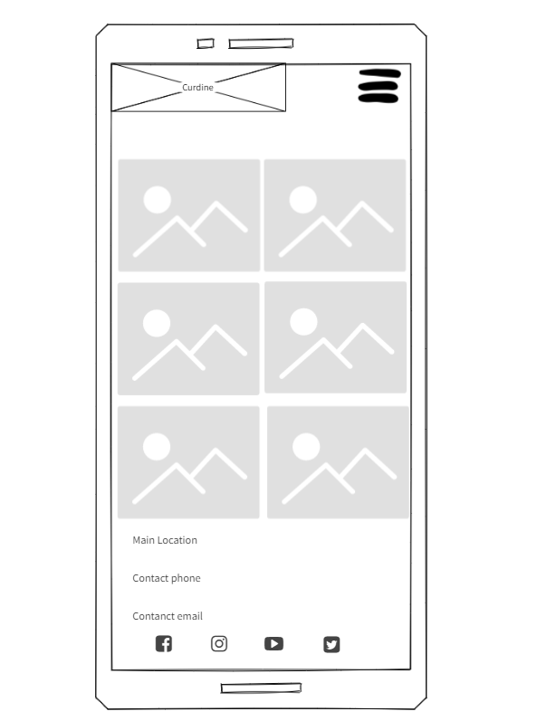

Update Profile

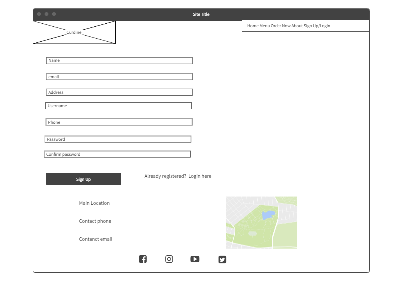
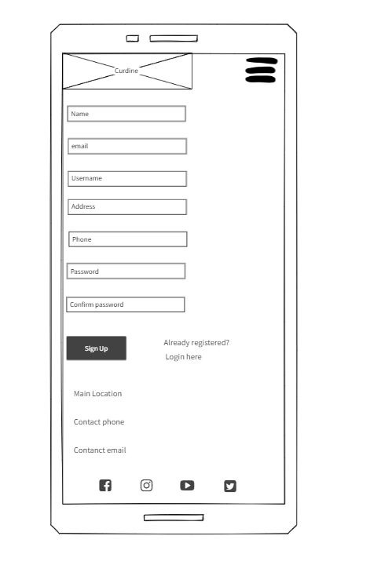

Order

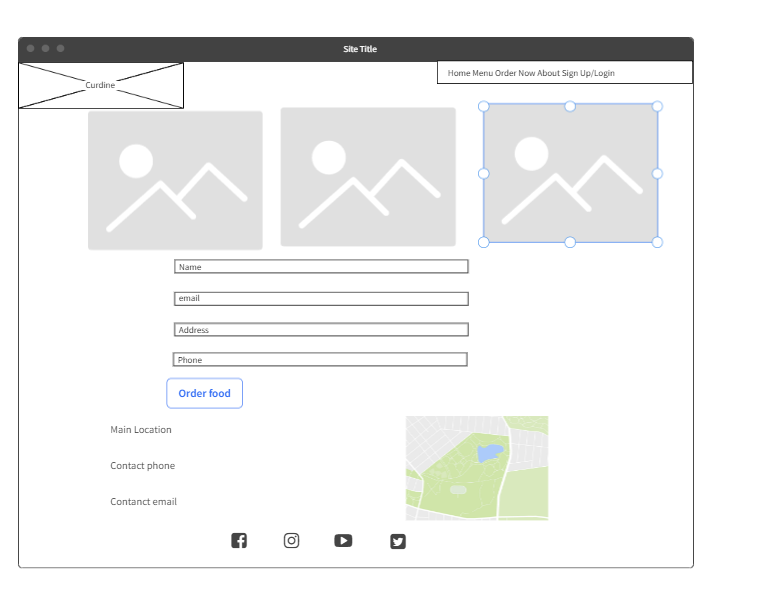
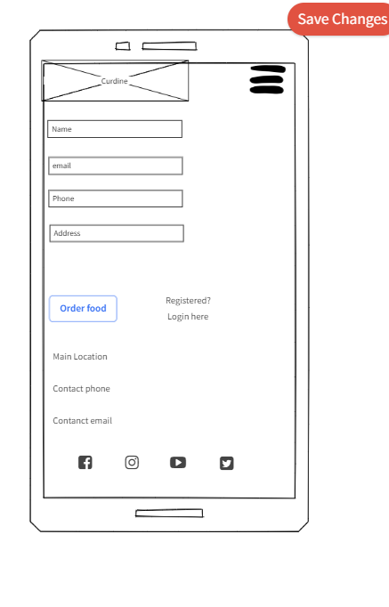

Order Confirmation

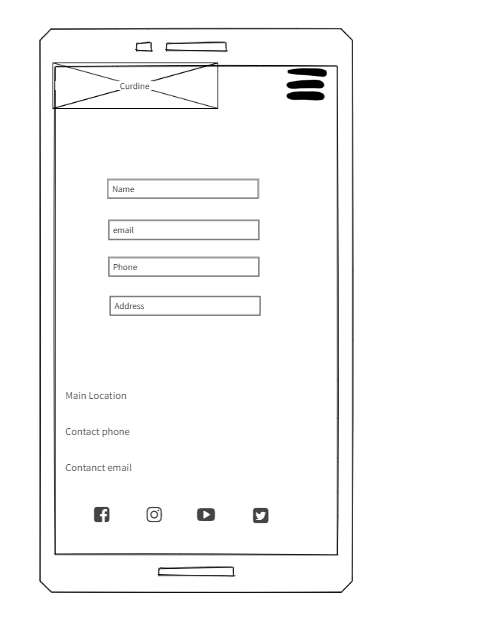

Food Item Details

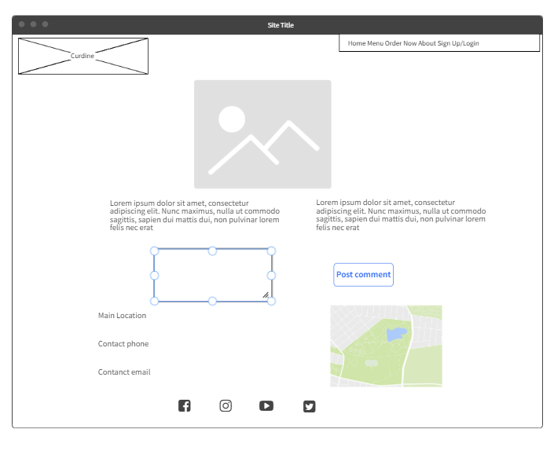
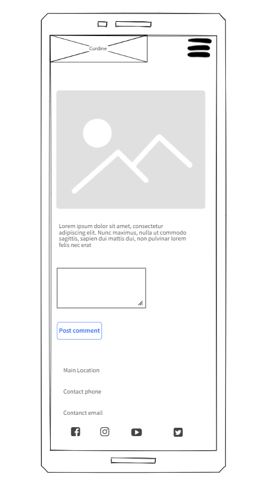

Login In

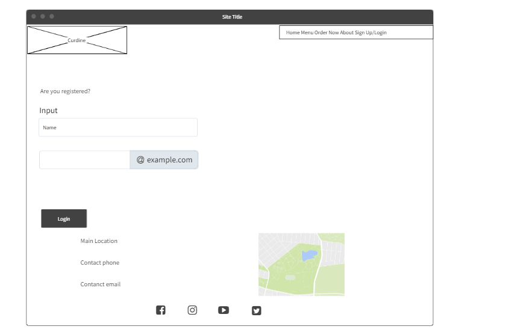
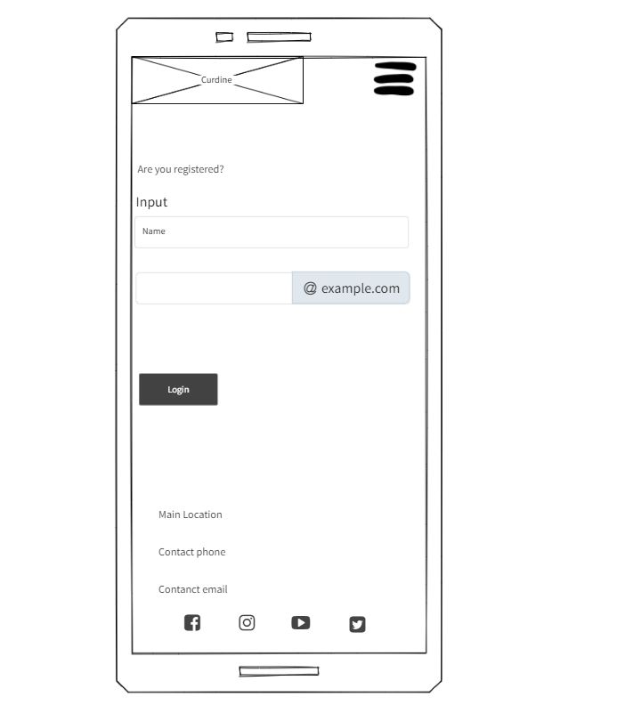

Sign Up

## Surface
### Design choices

The overall design of the website was to keep the site as clean and simple as possible, to allow the imagery of the food to shine through, and to choose colours that didn’t distract the user or take focus away from main purpose.

The site is straightforward to navigate, with a high contrasting navigation bar to enable ease of use for the user to find other main pages.

The background is neutral but bright, the images are not the focal point of the home page so the user has an immediate feeling to search for the of the menu to see the food.

### Colours

The colour palette is:

 - #C8E6AC
 - #FFFFFF
 - text-white

After choosing a colour scheme I tested a number of palette options to make sure the it met accessibility standards. Idea was to keep it clean & simple with focus on readability.

 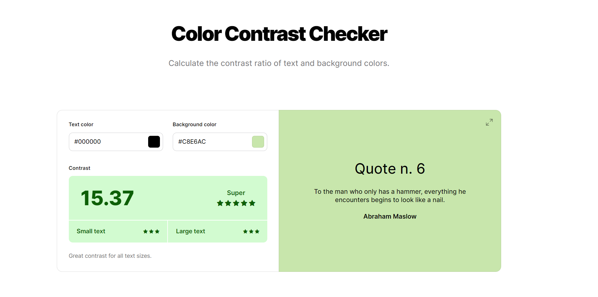

### Typography

Montserrat was choosen as the sites font as it is great for creating a simple and clean-looking web design. The font has nine styles from thin to black with a true italic to each. As a sans serif typeface, Montserrat has high readability.

## Features

The site contains 11 pages and
1. Home page
2. Full menu
3. Food Item
4. Order
5. Order Confirmation
6. Update Review
7. Delete Review
8. About
9. Update Profile
10. Login
11. Sign up

### Page 1 - Home page

## Technologies Used

### Languages
- [HTML5](https://en.wikipedia.org/wiki/HTML5)
- [CSS3](https://en.wikipedia.org/wiki/CSS)
- [JS ES6](https://en.wikipedia.org/wiki/JavaScript)
- [Django](https://www.djangoproject.com/)
- [Python3](https://en.wikipedia.org/wiki/Python_(programming_language))

#### Python Libraries

asgiref==3.5.2
cloudinary==1.29.0
crispy-bootstrap5==0.6
dj-database-url==1.0.0
dj3-cloudinary-storage==0.0.6
Django==3.2.15
django-crispy-forms==1.14.0
django-summernote==0.8.20.0
gunicorn==20.1.0
psycopg2==2.9.3
pytz==2022.2.1
sqlparse==0.4.2

### Frameworks & Tools
- [Bootstrap 5.0](https://getbootstrap.com/docs/5.0) - for general site layout, grid, flex, carousel.
- [Postgres](https://www.postgresql.org/) - the site is deployed on Heroku using a Postgress database.
- [SQLLite](https://www.sqlite.org/index.html) - this database was used in local development.
- [VSCode](https://code.visualstudio.com/) - my IDE of choice for this project.
- [Gitpod](https://gitpod.io/) - used occasionally for tutor support.
- [Github](https://github.com/) - used as the code repository.
- [Google Fonts](https://fonts.google.com/) - used for the main body font and some headings.
- [Balsamiq](https://balsamiq.com/) -  used to create the website wireframes.
- [Font Awesome](https://fontawesome.com/) - Font awesome was used to provide the relevant fonts/icons for the website social media icon links.
- [JQuery](https://jquery.com) - JQuery was used in some javascript files for DOM manipulation
- [CSS Validation Service](https://jigsaw.w3.org/css-validator/) - for validation of the css in the project.
- [HTML Markup Validation Service](https://validator.w3.org/) - for validation the HTML in the project.
- [Firefox dev tools](https://firefox-source-docs.mozilla.org/devtools-user/index.html) - troubleshooting and debugging of the project code.
- [Chrome Lighthouse](https://developers.google.com/web/tools/lighthouse) - for performance, accessibility, progressive web apps, SEO analysis of the project code.
- [Responsive Design](http://ami.responsivedesign.is/) - for website mockup.
- [JSHint](https://jshint.com/) - for javascript validation.
- [PEP8](https://www.python.org/dev/peps/pep-0008/) - for python validation.
- [Quick Database diagrams](https://www.quickdatabasediagrams.com)- for the database schema diagram.

## Validation

### HTML Validation
The HTML of the each page of the site was validated using [W3C Markup Validation Service](https://validator.w3.org/).  All pages returned a pass with 0 errors and 0 warnings.

### CSS Validation
The [W3C CSS Validation Service](http://jigsaw.w3.org/css-validator/validator) was used to validate the CSS of the website. 

The custom CSS file for the site passed with 0 errors.

Custom CSS file

### JS Validation
The Javascript of the each page of the site was validated using [JSHint validation tool](https://jshint.com/).  All pages returned a pass with 0 errors and 0 warnings.

script.js

### Py Validation
The Python of the each page of the site was validated using [Python validation tool](http://pep8online.com/).  All pages returned a pass with 0 errors and 0 warnings.

Details

#### Admin py-validation

#.py

#### Forms py validation

/forms.py

#### Models py validation

#models.py

#### Urls py validation

#/urls.py

#### Views py validation

#/views.py

#### Urls py validation

#/urls.py

### Accessibility
The [WAVE WebAIM web accessibility evaluation tool](https://wave.webaim.org/ was used to ensure the website met high accessibility standards. All pages returned 0 errors.

Home

Menus

About

Order

Profile

### Performance 
[Google Lighthouse](https://developers.google.com/web/tools/lighthouse/) was used to measure the performance and speed of the website -performance, accessibility, best practice and SEO with results below:

Home

Menu

About

Order

Profile

### Testing user stories

1. As a first time user, I want to be able to view the type of food the restaurant provides

| **Feature** | **Action** | **Expected Result** | **Actual Result** |
|-------------|------------|---------------------|-------------------|
|  Menu page   | Select any menu option from main nav bar           |     Menu page is displayed with images and information                | Works as expected |
|      Menu page       |    Select menu item links        |    Menu page is displayed with images and information by category                 | Works as expected |

Images

## Bugs

| **Bug** | **Fix** |
| ----------- | ----------- |
|  Installed incorrect django version | solved - pip3 install 'django<4' gunicorn |
| ERROR: Could not build wheels for backports.zoneinfo, which is required to install pyproject.toml-based projects | solved - create runtime.txt & vers 9(python-3.9.13) |
| Profile table - changed zip code from Integarfield to Charfield lead to value error | solved - delete table from database and run migrations. |
| Profile Table - email set null = True caused integratiy error | solved - remove null value |
| You can submit order with no items | solved - add custom jquery to check if checkformcontrol has checked item |
| Order confirmation page doesn't have logged in user in Sign Up/Login in nav bar | solved -change context 'user' to 'oreder_user' |
| No alert for unchecked item | unresolved |

## Deployment

### Heroku

This application has been deployed from Github using Heroku. Here's how:

1. Create an account at heroku.com
2. Create an app, give it a name for example ci-ms4-elginis_restaurant, and select a region
3. Under resources search for postgres, and add a Postgres database to the app

Heroku Postgres

1. Note the DATABASE_URL, this can be set as an environment variable in Heroku and your local deployment(env.py)

2. Install the plugins dj-database-url and psycopg2-binary.

3. Run pip3 freeze > requirements.txt so both are added to the requirements.txt file

4. Create a Procfile with the text: web: gunicorn elginis_restuarant.wsgi:application for example

5. In the settings.py ensure the connection is to the Heroku postgres database

6. Ensure debug is set to false in the settings.py file

7. Add localhost/127.0.0.1, and elginisrestaurant.herokuapp.com to the ALLOWED_HOSTS variable in settings.py

8. Run "python3 manage.py showmigrations" to check the status of the migrations

9. Run "python3 manage.py migrate" to migrate the database

10. Run "python3 manage.py createsuperuser" to create a super/admin user

11. Install gunicorn and add it to the requirements.txt file using the command pip3 freeze > requirements.txt

12. From the CLI login to Heroku using the command heroku git:remote -a ci-ms4-elginisrestaurant

13. Disable collectstatic in Heroku before any code is pushed using the command heroku config:set DISABLE_COLLECTSTATIC=1 -a ci-ms4-elginisrestaurant

14. Push the code to Heroku using the command git push heroku master

15. Ensure the following environment variables are set in Heroku

16. Heroku Env variables

17. Connect the app to GitHub, and enable automatic deploys from main
Heroku Postgres

18. Click deploy to deploy your application to Heroku for the first time

19. Click on the link provided to access the application

20. If you encounter any issues accessing the build logs is a good way to troubleshoot the issue

### Forking the GitHub Repository 

By forking this GitHub repository you are making a copy of the original to view or make changes without affecting the original. You can do this by following these steps...

1. Log into your GitHub account and find the [repository](https://github.com/dannymagnus/CI_MS3_MitsurukiFMS).
2. Click 'Fork' (last button on the top right of the repository page).
3. You will then have a copy of the repository in your own GitHub account. 

### Making a Local Clone

1. Log into your GitHub account and find the [repository](https://github.com/dannymagnus/CI_MS4_Elginis_Restaurant).
2. Click on the 'Code' button (next to 'Add file'). 
3. To clone the repository using HTTPS, under clone with HTTPS, copy the link.
4. Then open Git Bash.
5. Change the current working directory to where you want the cloned directory to be made.
6. In your IDE's terminal type 'git clone' followed by the URL you copied.
7. Press Enter. 
8. Your local clone will now be made.

## Credits

1. Legion Script for inspiration on order page - (https://www.youtube.com/watch?v=TXv2lbbhsOc)
2. Django community - (https://django.fun/qa/328691/)
3. Slack Community - (https://stackoverflow.com/questions/58452648/how-to-reference-a-slug-from-a-different-model-in-get-success-url)
4. CI Tutor Support
5. Matt Rodgers CI for content inspiration from lessons.
6. W3Schools - (https://www.w3schools.com/)
7. iStock - (https://www.istockphoto.com/search/2/image?phrase=poutine)
8. Boostrap community - (https://getbootstrap.com/docs/5.0/)

### Media

Media from the following artists was used throughout the site.

- [Pexels](https://www.pexels.com/)
- [iStock](https://www.istockphoto.com/search/2/image?phrase=poutine)
- [Postgress-Deployment](https://github.com/pmeeny/CI-MS4-LoveRugby#deployment)
- Code for comments adapted from Code Institute Django blog

### Acknowledgements: 

- To my girlfriend Ewelina Wolska,my brother Fintan and family for testing, support, feedback, permissions for content and images on this project. 
- To my mentor Mo Shami for his invaluable guidance and direction.
- To the Code Institute slack community of students.
- To the Code Institute Tutors

